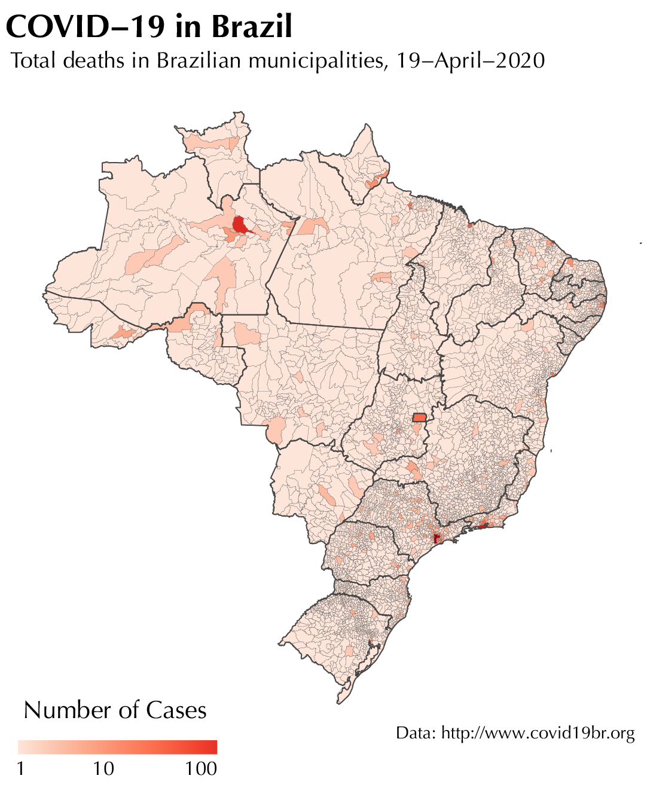
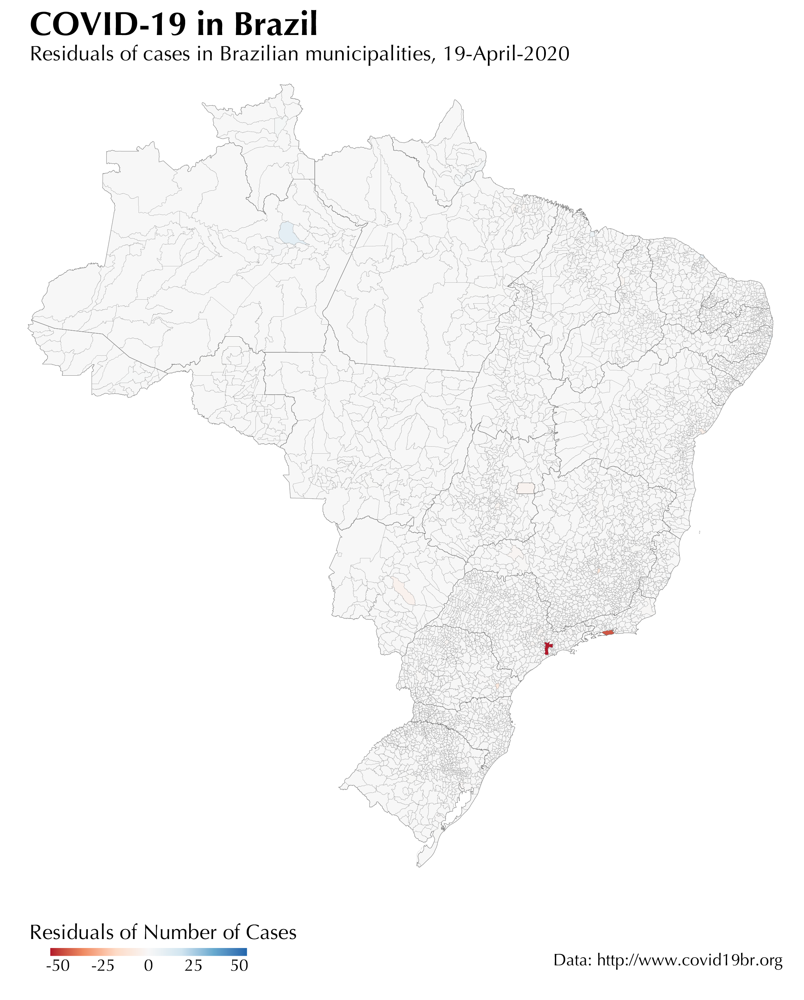

# Modelo espaço-temporal da difusão de SARS-CoV-2 nos municípios brasileiros

Considerando o atual cenário de pandemia de Covid-19 (Corona Virus Disease 2019) e o fato de que o Brasil é um dos principais países atingidos, resolvemos fazer uma análise preditiva espaço-temporal da vulnerabilidade dos municípios brasileiros a essa nova doença. Levamos em consideração diversos preditores como: tamanho da população residente, tamanho da população urbana com mais de 60 anos, etc...

## Casos de Covid-19 nos municípios brasileiros


``` r
library(leaflet)

m <- leaflet() %>%
  addTiles() %>%  # Add default OpenStreetMap map tiles
  addMarkers(lng=174.768, lat=-36.852, popup="The birthplace of R")
m
```

<!--html_preserve-->
<div id="htmlwidget-99c642ef23a9952c865b" style="width:100%;height:216px;" class="leaflet html-widget"></div>
  <script type="application/json" data-for="htmlwidget-99c642ef23a9952c865b">
<div id="htmlwidget-99c642ef23a9952c865b" class="leaflet html-widget" style="width:672px;height:480px;">

</div>

<script type="application/json" data-for="htmlwidget-99c642ef23a9952c865b">{"x":{"options":{"crs":{"crsClass":"L.CRS.EPSG3857","code":null,"proj4def":null,"projectedBounds":null,"options":{}}},"calls":[{"method":"addTiles","args":["//{s}.tile.openstreetmap.org/{z}/{x}/{y}.png",null,null,{"minZoom":0,"maxZoom":18,"tileSize":256,"subdomains":"abc","errorTileUrl":"","tms":false,"noWrap":false,"zoomOffset":0,"zoomReverse":false,"opacity":1,"zIndex":1,"detectRetina":false,"attribution":"&copy; <a href=\"http://openstreetmap.org\">OpenStreetMap<\/a> contributors, <a href=\"http://creativecommons.org/licenses/by-sa/2.0/\">CC-BY-SA<\/a>"}]},{"method":"addMarkers","args":[-36.852,174.768,null,null,null,{"interactive":true,"draggable":false,"keyboard":true,"title":"","alt":"","zIndexOffset":0,"opacity":1,"riseOnHover":false,"riseOffset":250},"The birthplace of R",null,null,null,null,{"interactive":false,"permanent":false,"direction":"auto","opacity":1,"offset":[0,0],"textsize":"10px","textOnly":false,"className":"","sticky":true},null]}],"limits":{"lat":[-36.852,-36.852],"lng":[174.768,174.768]}},"evals":[],"jsHooks":[]}</script>

<!--/html_preserve-->


|   |  |
|:---:|:---:|
| Número de mortes por Covid-19 por município | Diferença residual entre valores esperados (modelo) e valores observados |
